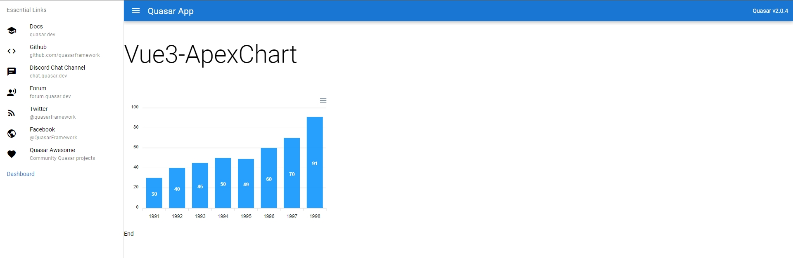

# TestApexCharts (testapexcharts)



## Information

This site project use Quasar Framework (Vue3) to try ApexChart.

## Install the dependencies
```bash
npm install
```

### Start the app in development mode (hot-code reloading, error reporting, etc.)
```bash
quasar dev
```

### Lint the files
```bash
npm run lint
```

### Build the app for production
```bash
quasar build
```

### Customize the configuration
See [Configuring quasar.conf.js](https://v2.quasar.dev/quasar-cli/quasar-conf-js).

## Reference
1. https://apexcharts.com/docs/vue-charts/
2. https://github.com/patrickmonteiro/quasar-apexcharts
3. https://github.com/apexcharts/vue3-apexcharts
4. https://www.npmjs.com/package/vue3-apexcharts